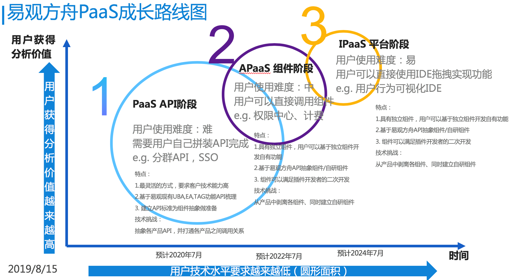
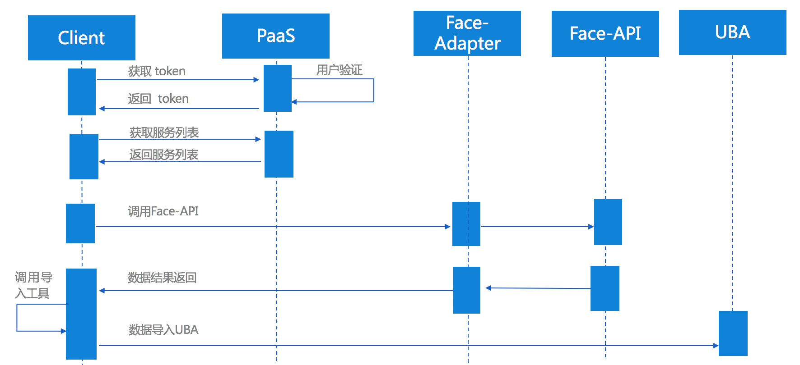
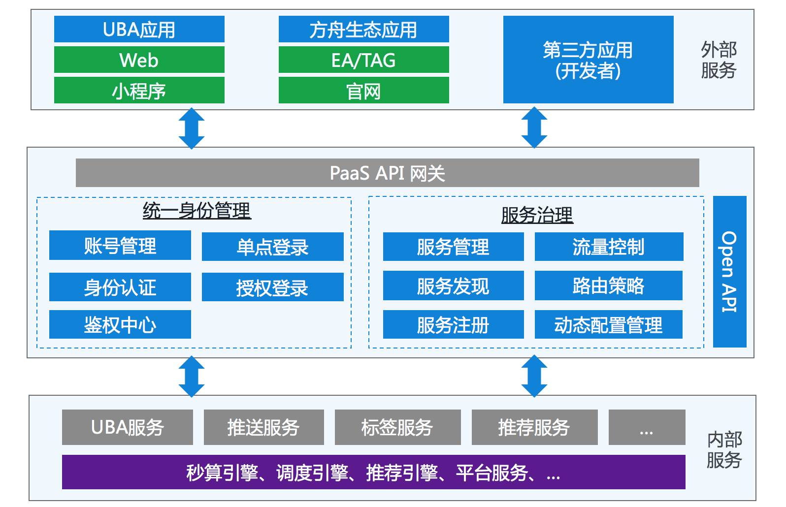
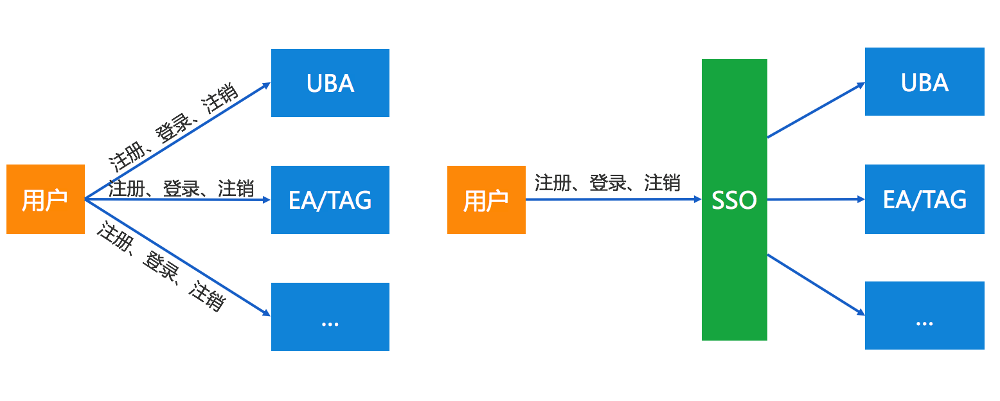
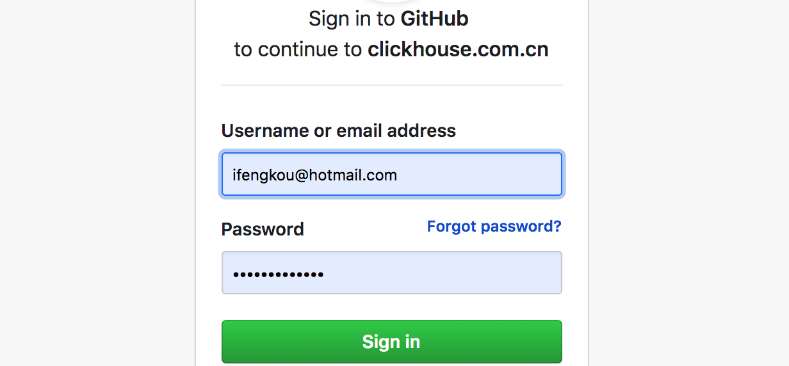
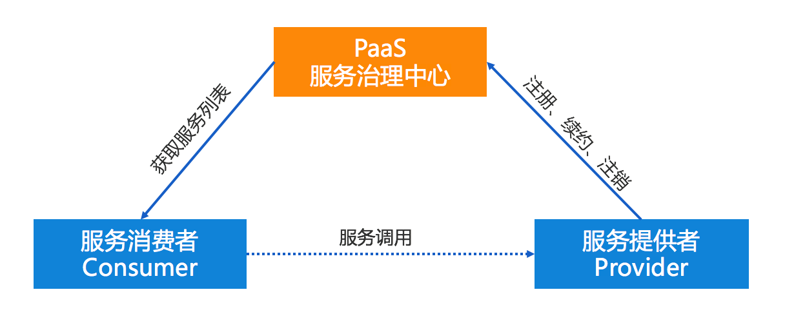
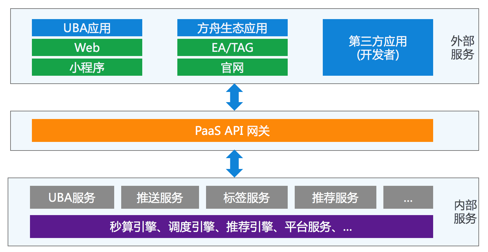
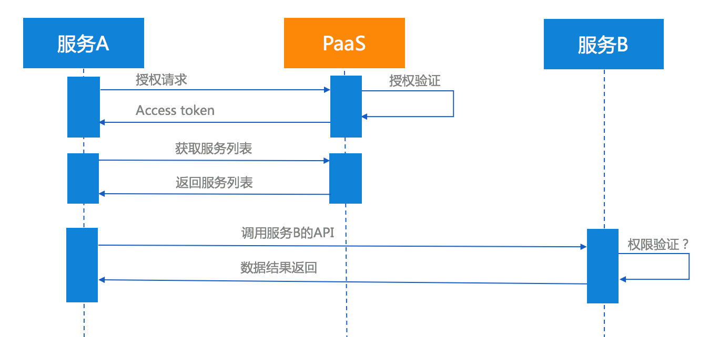
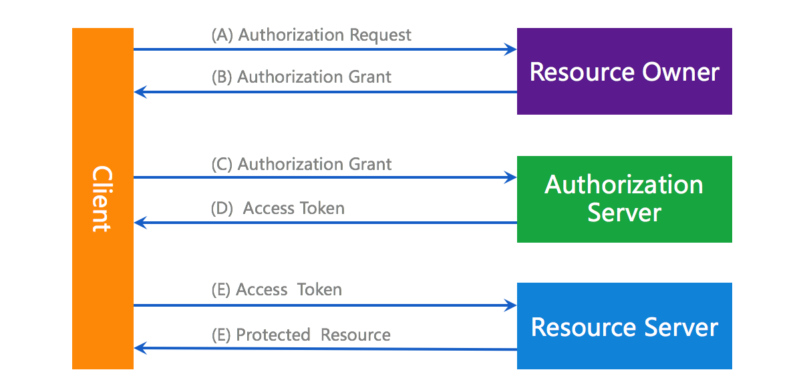

## PaaS架构详细设计

### 1 背景

随着方舟从UBA单产品逐渐衍生出EA、标签等生态产品，随着方舟生态业务发展到一定规模时，构建统一的标准化账户管理体系和泛服务能力必不可少的，因为它是方舟生态化平台化的重要基础设施，能够为平台带来统一的帐号管理、身份认证、用户授权等基础能力，为生态内系统带来诸如跨系统单点登录、第三方授权登录、API能力注册发现等基础能力，为构建开放平台和业务生态提供了必要条件。

### 2 需求分析

以第三方服务FaceAPI 接入为例，如果Client 需要使用FaceAPI获取Face数据，并将该数据写入到UBA数据库中，那么Client 就需要获取FaceApi开放的接口和UBA导入数据的接口。按照服务注册和发现的场景来说，FaceAPI 和 UBA 的相关能力需要先在PaaS 上进行注册，Client 也需要先通过信任审核获得AppSecret，然后通过与PaaS 进行授权认证后拿到 注册后的服务列表，然后调用相关的API接口，完成业务流程。 

随着方舟从UBA单点应用转向生态平台发展，将来会出现越来越多的生态产品和第三方产品，各个产品如果再维护一套各自的用户账号体系，产品之间的用户认证如何打通，授权如何管理，这时候就需要将用户身份认证剥离出来统一管理，同时开放单点登录、授权登录、用户信息授权等功能，满足生态产品发展的基础需求

所以目前迫切的需求为：1、方舟生态内应用系统的统一的用户身份认证，需要从各个业务系统各自维护一套用户认证模块到统一维护；第二点是，方舟内部开放的能力和第三方服务如何进行注册开放，服务之间如何如何做鉴权

按照一期规划，细化的主要功能需求有以下几点：

1. 统一身份管理
2. 单点登录
3. 授权登录
4. 服务注册和发现
5. 服务鉴权

#### 2.1 统一身份管理

统一身份管理可以认是多租户软件架构的升级版，通常是整个平台帐号和权限管控的基础性系统，平台下所有系统的账户管理、身份认证、用户授权、权限控制等行为都必须经由该系统处理，提供帐号密码管理、基本资料管理、角色权限管理等功能。

基于`统一身份治理`的概念，可划分为两级账户体系、基础权限模块和基础信息模块三大模块。其中两级账户体系将账户分为组织实体帐号和个人实体账户两大类，个人实体从属于组织实体，也可以不从属任何组织实体，且个人实体可同时从属于多个组织实体；

基础权限模块将各业务系统的**资源权限**（非业务权限）进行统一管理和授权；

基础信息模块用于描述组织实体和个人实体的基本信息，如组织实体名称、地址、法人，个人实体姓名、电话号码、性别等基础信息。

PaaS 提供统一的 API 与各子系统连接。

备注：

**业务权限独立**：每个子系统的权限体系是独立管理的。`个人账户统一`明确了账户体系是统一的，但是对于每个子系统而言，每个账户所能使用的功能和服务，所能查看的数据权限是独立维护

#### 2.2 单点登录

方舟平台涉及众多子系统，为简化各子系统的用户管理，提升用户体验，因此实现 SSO 是统一身份认证的重要目标：一次登录，全部访问。对于方舟内部应用来说，SSO 是必须的选项，例如UBA、EA、TAG等内部系统；对于外部应用来说，SSO 是可选项，具体哪个应用应当加入 SSO 系统，由该业务系统决定。无论何种应用是否采用 SSO，PaaS 在技术上应当具备 SSO 的能力。

#### 2.3 授权登录

随着方舟PaaS平台业务的逐渐增长，依托于平台的，和平台依托的生态合作者和客户等资源将极大的丰富平台，因此必须构筑开放的生态系统，以支撑业务的进一步发展。必须开放平台级的授权登录功能，以允许第三方应用接入。通过三方授权登录，将平台的服务各能力开放给第三方，并将第三方的服务和能力接入平台，繁荣共生，共同发展。

举例：clickhouse 中国社区，无需开发自己的用户注册登录模块，通过Github 进行授权注册和登录。

#### 2.4 帐号登出和销毁

与 SSO 相对应，PaaS 应该支持一次登出，全部登出，即 SSOff（Single Sign-Off，非标准术语）；或者一次登出，部分登出，而是否全部登出或部分登出取决于用户的选择，例如用户在 Web 端登出后，是否无线端 APP 也登出，这取决于用户偏好，但系统应当提供这种能力。

此外，必须提供统一的销毁功能，以支持用户删除其账户，一次销毁，全部销毁。

#### 2.5 服务发现与注册

第三方开发者 可以申请成为生态合作伙伴，可以通过`PaaS服务治理中心`获取 相应的方舟能力，也可以向平台注册自己的能力

内部生态应用也是一样，即可以作为服务消费者从PaaS获取服务能力，也可以成为服务供应者向方舟输出能力

#### 2.6 服务间鉴权

方舟生态随着业务发展，一部分业务是由用户从外网客户端发起访问，例如UBA应用系统、方舟官网，需要通过登录认证后才能获取底层的资源服务。一部分业务是内部服务之间的资源调用，例如EA 需要用UBA 中的分群能力

- 外部服务的认证和授权
- 内部服务的认证和授权

通常，内部服务之间处于安全的内网环境之下，例如UBA服务直接调用推送服务、标签服务等，在对安全需求不高的情况下，可不执行认证过程，服务与服务之间是相互信任的（？）。

而外部服务的认证和授权，通常由外部应用发起，通过反向代理或网关向安全边界内的服务发起请求，因此必须执行严格的认证过程。无线端APP/小程序、Web端等外部应用下的各类服务，都属于外部服务。

问题: 内部系统中的服务的信任机制：是否可以直联

#### ~~2.7 分布式设计（非功能需求）~~

CAP

- 一致性(Consistency) (它要求在同一时刻点，分布式系统中的所有数据备份都处于同一状态)
- 可用性(Availability) (在系统集群的一部分节点宕机后，系统依然能够响应用户的请求。)
- 分隔容忍(Partition tolerance) (网络区间通信出现失败，系统能够容忍)

对于服务发现场景来说：针对同一个服务，即使注册中心的不同节点保存的服务提供者信息不尽相同，也并不会造成灾难性的后果。因为对于服务消费者来说，能消费才是最重要的——拿到可能不正确的服务实例信息后尝试消费一下，也好过因为无法获取实例信息而不去消费。

所以，**对于服务发现而言，可用性比数据一致性更加重要——AP胜过CP**。

问题：是否需要分布式

#### ~~2.8 付费授权~~

暂不考虑

### 3 技术方案

#### 3.1 设计原则

- 基础方法论(边界)：IOTA架构、Common-DATA数据模型
- 支持私有化部署
- 分布式设计，AP 胜过CP
- 简单原则、演化原则、开放性原则
- 轻量化设计：微服务理念，但是非微服务形态，整个PaaS是One App

#### 3.2 统一用户身份管理

**两级账户体系**：两级账户体系将账户分为组织实体帐号和个人实体账户两大类，个人实体从属于组织实体（方舟云平台需要，私有化部署，可以区分部门、分子公司）

**个人账户统一**：个人账户一次注册，全平台通用，类似于全网通行证和 SSO，注册和登录都在 PaaS 进行

**业务权限独立**：每个子系统的权限体系是独立管理的。`个人账户统一`明确了账户体系是统一的，但是对于每个子系统而言，每个账户所能使用的功能和服务，所能查看的数据权限是独立维护

**组织实体隔离**：不同的组织实体之间，是相互隔离，独立管理的。每个组织实体可以自行组织自己的组织体系、账户体系和权限体系

**从属关系隔离**：个体账户与组织实体的从属关系是基于单独的业务系统存在的，`个人账户统一`明确的仅是个人账户的全网统一，但组织实体、从属关系并没有统一，并且是隔离的

权限体系和功能点需要详细设计

#### 3.3 授权登录、单点登录SSO 备选方案

- 分布式 Session 
- OAuth2.0
- JWT
- CAS

`分布式 Session` 是老牌的成熟解决方案，但因其状态化通信的特性与微服务提倡的API导向无状态通信相互违背，且共享式存储存在安全隐患，因此微服务一般不太采用。

`OAuth2.0` 是业内成熟的授权登录解决方案，然而 OAuth2.0 提供了4种授权模式，能够适应多种场景，作为基于令牌的安全系统，可以广泛用于需要统一身份认证和授权的场景。

`JWT（JSON Web Token）`是一种简洁的自包含的 JSON 声明规范，因其分散存储的特点而归属于客户端授权模式，广泛用于短期授权和单点登录。由于 JWT 信息是经过签名的，可以确保发送方的真实性，确保信息未经篡改和伪造。但由于其自包含的客户端验签特性，令牌一经签发，即无法撤销，因此单纯采用 JWT 作为统一身份认证和授权方案无法满足帐号统一登出和销毁、帐号封禁和解除这几种类型的需求。

`CAS` 是时下最成熟的开源单点登录方案，包含 CAS Server 和 CAS Client 两部分。CAS Server 是一个 war 包需要独立部署，负责用户认证；CAS Client 负责处理对客户端受保护资源的访问请求，需要认证时，重定向到 CAS Server。值得注意的是，CAS 是一个认证框架，其本身定义了一套灵活完整的认证流程，但其兼容主流的认证和授权协议如 OAuth2、SAML、OpenID 等，因此一般采用 CAS + OAuth2 的方案实现 SSO 和授权登录。

在微服务架构下，身份认证和用户授权通常分离出来成为独立的鉴权服务。从以下几点考虑：

1. 满足 SSO 的技术需求；
2. 满足简便性和安全性的需求；
3. 满足开放性和扩展性的需求。

> 综合考虑，推荐采用无状态 API 模式，其中 OAuth2.0 能够完全满足。此外 JWT 除了不能满足 SSOff 外，其他都能满足，且是所有方案里最为简便轻巧的一个，可通过搭配 API 网关来满足 SSOff 特性的要求，因此 JWT + API 网关也是一个推荐的方案。

#### 3.4 授权登录、单点登录SSO 推荐方案 OAuth2.0

##### 3.4.1 OAuth2.0 的四种授权模式

- 授权码模式（authorization code）
- 简化模式（implicit）
- 密码模式（resource owner password credentials）
- 客户端模式（client credentials）

其中密码模式常用于外部服务的鉴权，客户端模式常用于内部服务鉴权和开放平台应用的授权，授权码模式常用于社会化登录和 SSO，因此 OAuth2.0 可作为完整的统一身份认证和授权方案。

##### 3.4.2 OAuth2.0 四种授权模式的应用场景

| 场景                          | 描述                                                         | 适用模式                                                   |
| :---------------------------- | :----------------------------------------------------------- | :--------------------------------------------------------- |
| ~~用户注册（外部服务）~~      | 用户在 APP 提供的注册页面，完成注册请求                      | 非受控接口，无须鉴权                                       |
| 用户登录，返回 token          | 用户在 APP 提供的登录页面，完成登录请求，获得 token          | 密码模式（resource owner password credentials）            |
| ~~用户注册~~                  | 方舟现有业务是通过管理员添加用户，而非注册制                 | 非受控接口，无须鉴权                                       |
| 社会化授权登录/单点登录       | 用户跳转到 PaaS 的登录页面获取授权，完成登录操作，获得授权码，然后携带授权码跳转到重定向URI，再获得 token | 授权码模式（authorization code）                           |
| 外部服务的鉴权                | 外部服务直接使用UBA-API？                                    | 密码模式（resource owner password credentials）            |
| 内部服务的鉴权                | 图像识别服务向配置服务获取配置信息                           | 客户端模式（client credentials），或简单的 HTTP Basic 验证 |
| 开发者：获取和使用PaaS 能力集 | 外部认证通过后获取、内部直接获取(?)                          | 客户端模式（client credentials）                           |
| 开发者：第三方应用接入PaaS    | 申请、审核、接入                                             | 客户端模式（client credentials）                           |
|                               |                                                              |                                                            |

##### 3.4.3 跨系统单点登录

- CAS实现登录凭证跨域共享

- OAuth2.0验证机制统一登录入口及资源获取

SSO方案， 目前最成熟的方案是CAS。但是考虑到系统复杂度，建议采用oauth2的授权码方式进行实现，Spring Security Oauth2 已经集成了SSO功能

##### 3.4.4 授权登录

1. 第三方应用请求用户授权。
2. 用户同意授权，并返回一个凭证（code）
3. 第三方应用通过第二步的凭证（code）向授权服务器请求授权
4. 授权服务器验证凭证（code）通过后，同意授权，并返回一个资源访问的凭证（Access Token）。
5. 第三方应用通过第四步的凭证（Access Token）向资源服务器请求相关资源。
6. 资源服务器验证凭证（Access Token）通过后，将第三方应用请求的资源返回。

通过oauth2.0 授权码模式6个步骤，第三方客户系统就可以顺利完成用户认证，拿到登录用户信息

##### 3.4.5 第三方开发者获取PaaS 能力集和向PaaS 注册能力

1.开发者在PaaS平台注册账号

2.向PaaS方申请创建第三方应用，通过审核后（人工？），发放应用AppID(不同于方舟的Appkey) 和 AppSecret给开发者。

3.按照oauth2.0 规范获取Access Token（oauth客户端模式）

4.根据Access Token 获取与PaaS 进行交互

#### 3.5 服务治理备选方案

| Feature          | Consul                 | Zookeeper      | Etcd              | Euerka                | **Nacos**                  |
| ---------------- | ---------------------- | -------------- | ----------------- | --------------------- | -------------------------- |
| CAP原则          | CP                     | CP             | CP                | AP                    | CP+AP                      |
| K-V存储服务      | 支持                   | 支持           | 支持              | --                    | 支持                       |
| 负载均衡策略     | Fabio                  | —              | raft              | Ribbon                | 权重、metadata、Selector   |
| 多数据中心       | 支持                   | --             | --                | --                    | 支持                       |
| 访问协议         | http/dns               | 客户端         | http和grpc        | 客户端/http           | http/dns                   |
| SpringCloud 集成 | 支持                   | 支持           | 支持              | 支持                  | 支持                       |
| 安全             | acl/https              | acl            | https             | --                    | acl/https                  |
| watch支持        | 全量/支持 long polling | 支持           | 支持 long polling | 支持long polling/增量 | 支持                       |
| 雪崩保护         | --                     | --             | --                | 有                    | 有                         |
| 健康检查         | TCP/HTTP/gRPC/Cmd      | Keep Alive检查 | 连接心跳检查      | Client Beat           | TCP/HTTP/MYSQL/Client Beat |
| 跨注册中心同步   | 支持                   | --             | --                | --                    | 支持                       |
|                  |                        |                |                   |                       |                            |

对于服务发现而言，可用性比数据一致性更加重要——AP胜过CP。

Eureka 典型的 AP,作为分布式场景下的服务发现的产品较为合适，服务发现场景的可用性优先级较高，一致性并不是特别致命。其次 CP 类型的场景 Consul,也能提供较高的可用性，并能 k-v store 服务保证一致性。 而Zookeeper,Etcd则是CP类型 牺牲可用性，在服务发现场景并没太大优势；

Zookeeper的跨语言支持较弱，其他几款支持 http11 提供接入的可能。Euraka 一般通过 sidecar的方式提供多语言客户端的接入支持。Etcd 还提供了Grpc的支持。 Consul除了标准的Rest服务api,还提供了DNS的支持。

#### 3.6 服务治理推荐方案

Consul

Euerka

Nacos

**最大的区别是Eureka保证AP, Consul为CP。**

Consul强一致性(C)带来的是：

1. 服务注册相比Eureka会稍慢一些。因为Consul的raft协议要求必须过半数的节点都写入成功才认为注册成功
2. Leader挂掉时，重新选举期间整个consul不可用。保证了强一致性但牺牲了可用性。

Eureka保证高可用(A)和最终一致性：

1. 服务注册相对要快，因为不需要等注册信息replicate到其他节点，也不保证注册信息是否replicate成功
2. 当数据出现不一致时，虽然A, B上的注册信息不完全相同，但每个Eureka节点依然能够正常对外提供服务，这会出现查询服务信息时如果请求A查不到，但请求B就能查到。如此保证了可用性但牺牲了一致性。

Nacos

Nacos 是阿里巴巴的新开源项目，其核心定位是 “一个更易于帮助构建云原生应用的动态服务发现、配置和服务管理平台”

#### 3.7 API 网关

- ZUUL
- Spring Cloud Gateway
- Linkerd

要不要网关? 

### 参考

[平台级SAAS架构的基础-统一身份管理系统](https://mtide.net/平台级SAAS架构的基础-统一身份管理系统.html)

[sso 原理详解](https://blog.csdn.net/yuxin6866/article/details/73522312)

[理解OAuth 2.0](http://www.ruanyifeng.com/blog/2014/05/oauth_2_0.html)

[移花接木：针对OAuth2的攻击](http://insights.thoughtworkers.org/attack-aim-at-oauth2/)

[分布式中几种服务注册与发现组件的原理与比较](https://juejin.im/post/5bb77923f265da0af3348aa3)

[API 网关性能比较：NGINX vs. ZUUL vs. Spring Cloud Gateway vs. Linkerd](https://www.infoq.cn/article/comparing-api-gateway-performances)